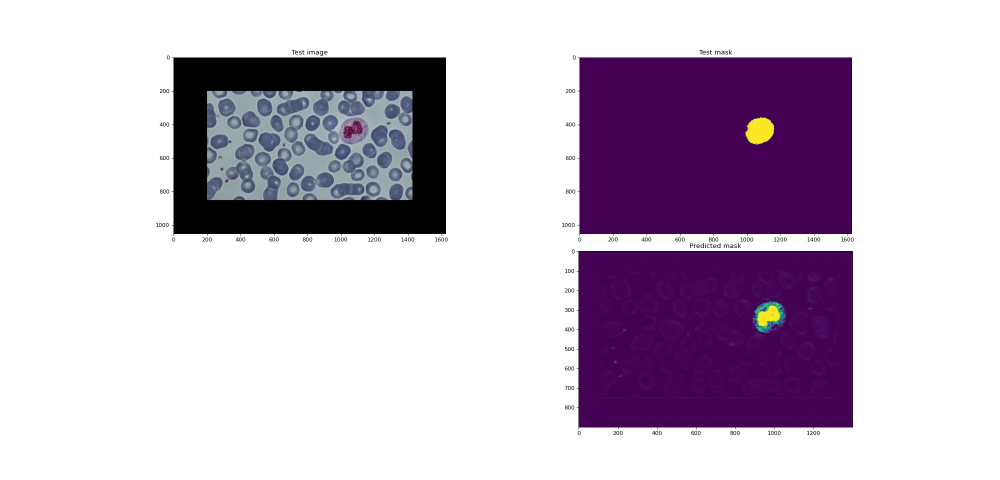

# The production version is at [nemo256/cbc](https://github.com/nemo256/cbc)
# Blood Cells Count
Count red, white blood cells to detect various diseases such as blood cancer (leukemia), lower red blood cells count (anemia)...



<!-- TABLE OF CONTENTS -->
## Table of Contents

* [Project Structure](#project-structure)
* [Install](#install)
* [Usage](#usage)
* [Develop](#develop)
* [License](#license)

## Project Structure
```
bc-count/
|-- bc-count/
|   |-- config.py
|   |-- data.py
|   |-- main.py
|   |-- model.py
|
|-- bin/
|   |-- bc-count
|
|-- docs/
|
|-- data/
|   |-- plt/
|   |-- rbc/
|   |-- wbc/
|
|-- models/

|-- output/
|   |-- plt/
|   |-- rbc/
|   |-- wbc/
|
|-- AUTHORS
|-- LICENSE
|-- README.md
|-- TODO.md
|-- requirements.txt 
|-- setup.py
```

## Install
- Install straight from PyPI using pip:
```
$ pip install bc-count
```
## Usage
> Please read `bc-count --help` before using it
> -o flag is optional (defaults to out/ directory)
- Count blood cells (-r for red and -w for white):
```
$ bc-count -r <blood-cell-image>
```
- Predict blood cell image:
```
$ bc-count predict -r <blood-cell-image>
```
- Train a new model:
```
$ bc-count train -r <model-name>
```

## Develop
- Download the project:
```
$ git clone https://github.com/nemo256/bc-count
$ cd bc-count
```
- Activate virtual environment:
```
$ python -m venv venv
$ source venv/bin/activate
$ pip install -r requirements.txt
```
- Now just adapt the code to your need and then run using the command:
```
$ python bc-count/main.py
```

## License
- Please read cell-count/LICENSE.
